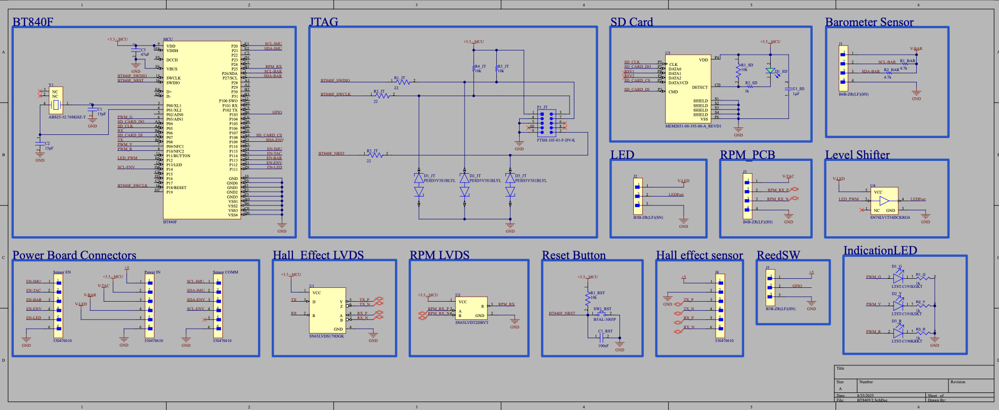
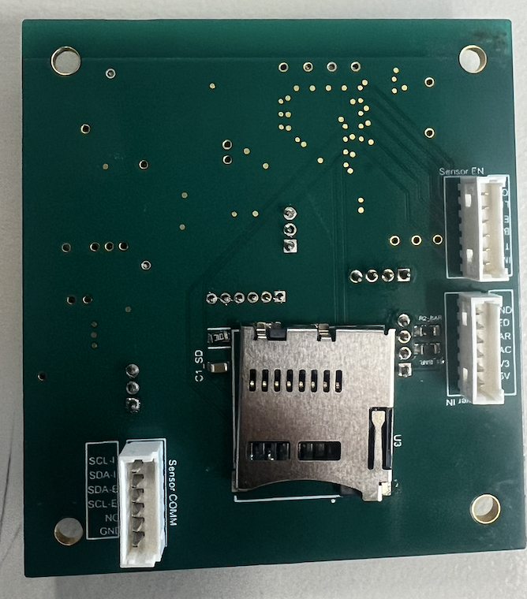
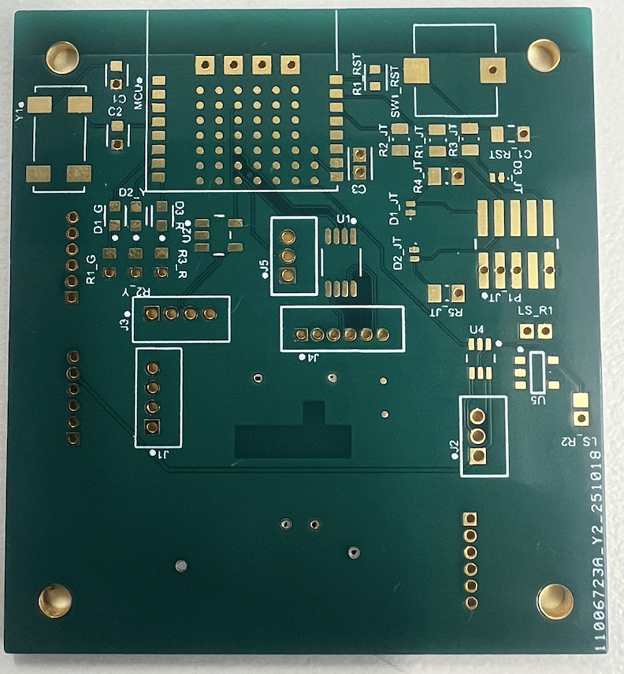
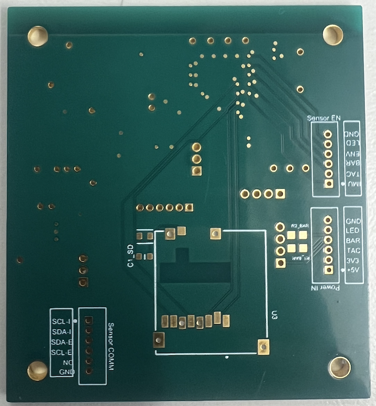

# Data-Acquisition-Module-PCB
6 Layer 50.00mm x 50.00mm PCB handling all incoming sensor data on the submarine

# Project Description 
This project is the design and fabrication of a 6-layer PCB to serve as the main data acquisition board for a human-powered submarine. The board's primary function is to collect real-time sensor data and provide visual feedback to the pilot via an LED system. It will interface with a barometer for depth and pressure measurements, temperature/humidity sensor for monitoring internal environmental conditions. The board will also be integrated with a separate tachometer design to measure propeller RPM. There is also an SD card mount on the back of the PCB to log the data from the sensors.

# Schematic 

# Issue regarding I2C
Some of the sensor's I²C bus was unreliable over the long cable run because I²C is a short-distance protocol. The long cable's capacitance slowed the signal's transitions, making it difficult for the receiving device to interpret the data correctly. To solve this, a local microcontroller to read the sensor data via a short I²C connection. The microcontroller then transmitted the data over the long cable using UART, which is a more robust protocol for longer distances. To further improve reliability, the UART signal was paired with Low-Voltage Differential Signaling (LVDS), which uses a pair of wires to send a signal and its inverse. This differential signaling would cancels out external noise. 

# Layout
The 50mm x 50mm PCB presented placement challenges due to two key components: an antenna on the top layer and an SD card on the bottom layer. The board dimensions were constrained by the enclosure size. Design requirements included maintaining clear space below both the antenna (to ensure optimal Bluetooth performance for future project cycles) and the SD card component. The SD card provides local data storage for extended testing periods, eliminating concerns about the microcontroller's limited storage capacity.

Front Prototype assembled: 

Back Prototype assembled: 

Front PCB: 

Back PCB: 

# 4 Layer Design
A four-layer board was initially considered, but concerns arose about high-speed signal integrity due to the numerous signals routed to surface-mounted pins and potential trace interference. To ensure reliable performance, a six-layer board was ultimately selected, providing better isolation between different ground planes and signal layers.

# 2 Layer Design
Initially, the main PCB was designed as a 2-layer board. However, due to the high-speed signals and the large number of traces required, a 4-layer board was considered to be a more suitable option.
 
# Issues and Challenges
One issue encountered was with the LED system. The microcontroller outputs 1.6V signals, but the LED system requires 5V. The current logic level shifter (3.3V to 5V) cannot properly handle the 1.6V input signal. The proposed solution is to cascade two logic shifters: first converting 1.6V to 3.3V, then 3.3V to 5V. Since this is a one-way communication with no return data, the cascaded setup should not present any concerns.

Another issue was the placement constraints of surface-mounted components. The antenna required clear space with no components or copper layers beneath it, while the SD card also needed an unobstructed area underneath. Additionally, various connectors had to align geographically with the power board, creating predetermined placement constraints. These limitations made component placement challenging on a standard PCB design. A six-layer board was selected to accommodate these restrictions while properly routing traces around the SD card, antenna, and pre-positioned connectors.

The current challenge involves soldering a Ball Grid Array (BGA) microcontroller. Because hand-soldering this package style is difficult and time-consuming, a stencil has been ordered to facilitate the process. Utilizing an assembly service is also under consideration to prevent further loss of labor hours and potential errors. Successful soldering will be verified by testing the onboard status LEDs with a "blinky" program. Once hardware functionality is confirmed, additional firmware will be flashed to evaluate full system compatibility.
