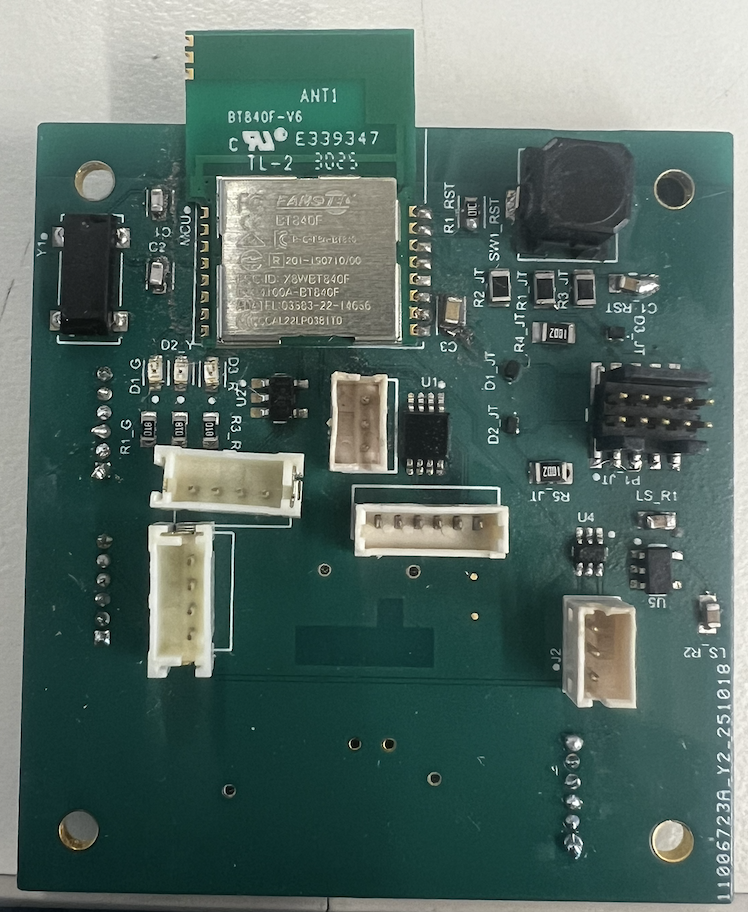
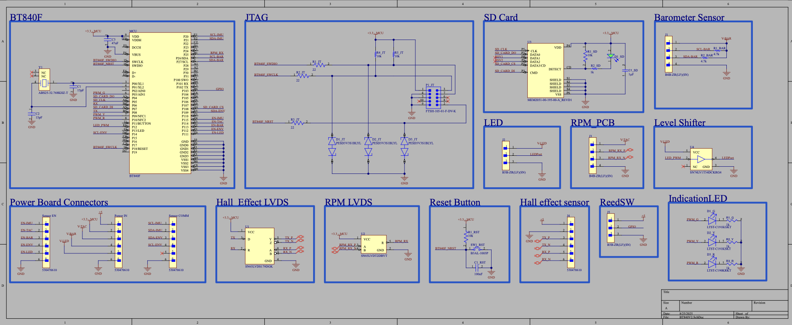
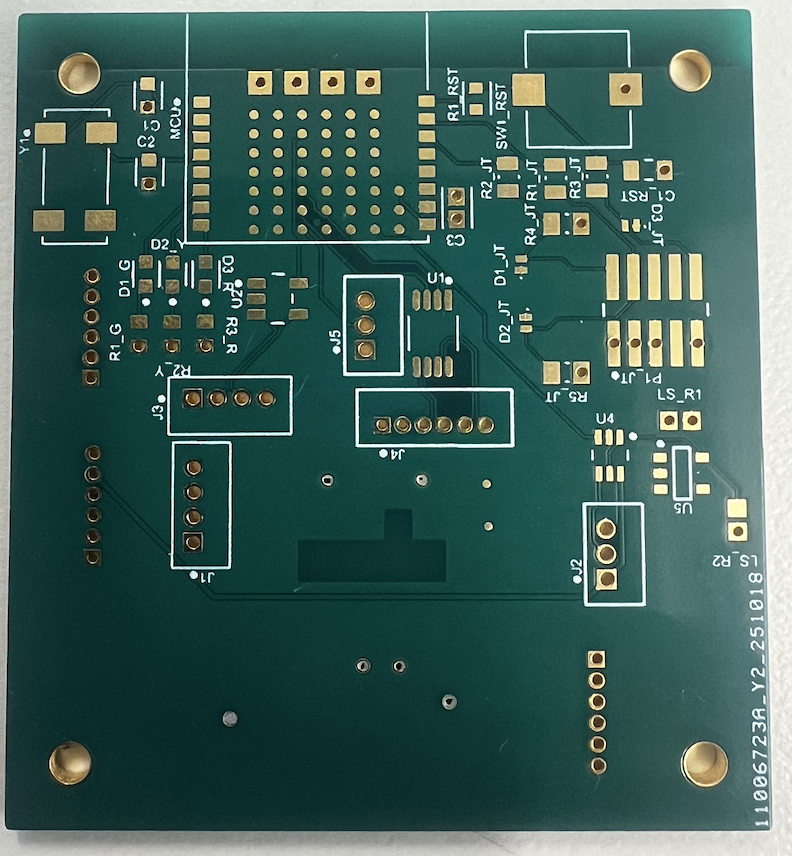
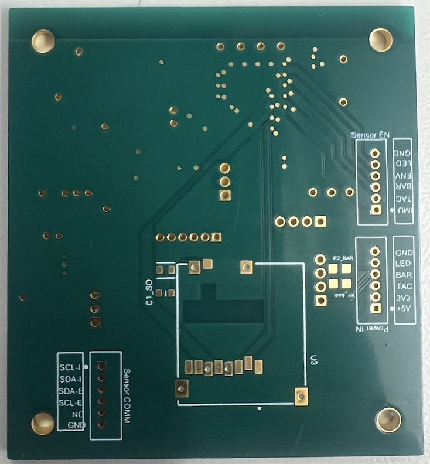
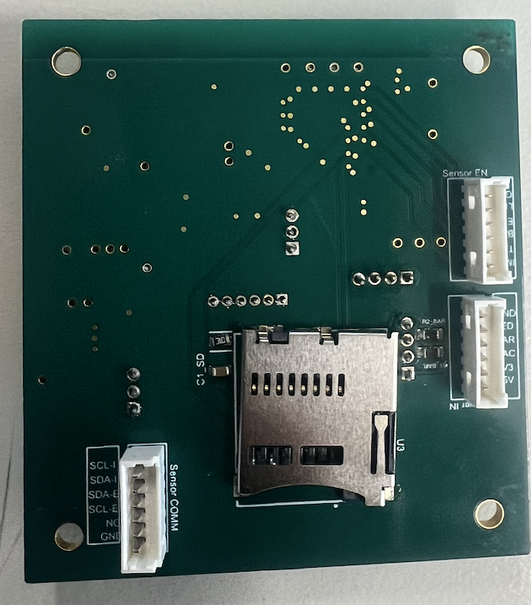

# Data Acquisition Module PCB

6-layer, 50mm x 50mm PCB designed to collect and log real-time sensor data aboard a human-powered submarine.



## Overview

This board serves as the central data acquisition system for a human-powered submarine. It collects environmental sensor data, provides pilot feedback via LEDs, and logs everything to an onboard SD card.

**Key capabilities:**
- Barometric pressure and depth measurement
- Temperature and humidity monitoring
- Propeller RPM tracking (via external tachometer interface)
- Onboard SD card data logging
- LED status indicators for pilot feedback
- Bluetooth-ready antenna placement for future connectivity

## Hardware

| Spec | Detail |
|------|--------|
| MCU | BT840F (Nordic nRF52-based) |
| Board size | 50mm x 50mm |
| Layer count | 6 |
| Sensors | Barometer (depth/pressure), temperature/humidity |
| Communication | I2C (local), UART + LVDS (long-distance) |
| Storage | Micro SD card (bottom-mounted) |
| Feedback | LED system (5V, via cascaded logic level shifters) |
| Manufacturer | JLCPCB |

## Schematic



## Design Evolution

The board went through three design iterations to address signal integrity and routing constraints:

### 2-Layer (Initial)
The initial design used a standard 2-layer stackup. The high number of traces and high-speed signal requirements quickly exceeded what two layers could reliably support.

### 4-Layer (Revised)
A four-layer board improved routing flexibility, but concerns remained about signal isolation — particularly with numerous high-speed signals routed to surface-mount pads and potential trace interference.

### 6-Layer (Final)
The final 6-layer design provides proper ground plane isolation between signal layers, adequate routing channels around constrained components (antenna, SD card, connectors), and reliable high-speed signal integrity.

## Layout and Constraints

The 50mm x 50mm board dimensions were constrained by the submarine enclosure. Two components imposed strict keep-out zones:

- **Antenna (top layer):** No copper or components beneath it to ensure Bluetooth RF performance
- **SD card (bottom layer):** Clear area underneath required for card insertion and mechanical clearance

Connectors were pre-positioned to align geographically with the power board, further constraining component placement. The 6-layer stackup was essential to route around these restrictions.

### PCB — Pre-Assembly

| Front | Back |
|-------|------|
|  |  |

### Prototype V1 — Assembled

| Front | Back |
|-------|------|
|  |  |

## Challenges and Solutions

### Long-Distance I2C Failure
**Problem:** The sensor I2C bus was unreliable over long cable runs. Cable capacitance degraded signal transitions, causing communication errors.

**Solution:** A local microcontroller reads sensor data via a short I2C connection, then transmits over the long cable using UART paired with LVDS (Low-Voltage Differential Signaling). LVDS sends a signal and its inverse on a wire pair, canceling out external noise and enabling reliable long-distance communication.

### LED Voltage Mismatch
**Problem:** The MCU outputs 1.6V logic, but the LED system requires 5V. The existing 3.3V-to-5V logic level shifter cannot handle 1.6V input.

**Solution:** Two cascaded logic level shifters: 1.6V to 3.3V, then 3.3V to 5V. Since LED control is one-way (no return data), the cascaded topology introduces no timing concerns.

### BGA Soldering
**Problem:** The BT840F MCU uses a Ball Grid Array package, which is extremely difficult to hand-solder. Initial hand-soldering attempts were unreliable and time-consuming.

**Solution:** A solder paste stencil was ordered to improve consistency. Professional assembly service (JLCPCB) is also being evaluated to eliminate manual soldering errors entirely.

### JTAG Programming Failure (Error -102)
**Problem:** The prototype failed to program via JTAG — the J-Link reported error -102 (cannot reliably communicate with the chip), indicating a hardware connectivity issue.

**Status:** Under investigation. Root causes include potential solder joint quality, signal integrity on JTAG traces, and power supply stability. See the full [JTAG Debug Report](docs/JTAG_Debug_Report.md) for details.

## Project Status

- [x] Schematic design
- [x] 6-layer PCB layout
- [x] PCB fabrication (JLCPCB)
- [x] Component sourcing
- [x] Prototype V1 hand assembly
- [ ] Resolve JTAG programming error (-102)
- [ ] Verify hardware with blinky LED test
- [ ] Flash full sensor acquisition firmware
- [ ] System integration testing on submarine

## Repository Structure

```
Data-Acquisition-Module-PCB/
├── README.md
├── assets/
│   ├── Schematic.png          # Circuit schematic
│   ├── front.png              # Assembled PCB front (V1)
│   ├── back.png               # Assembled PCB back (V1)
│   ├── frontb.png             # Bare PCB front
│   ├── backb.png              # Bare PCB back
│   ├── closeup_debug.png      # Debug session close-up
│   └── connection_setup.png   # JTAG debug setup
└── docs/
    └── JTAG_Debug_Report.md   # Error -102 investigation
```
